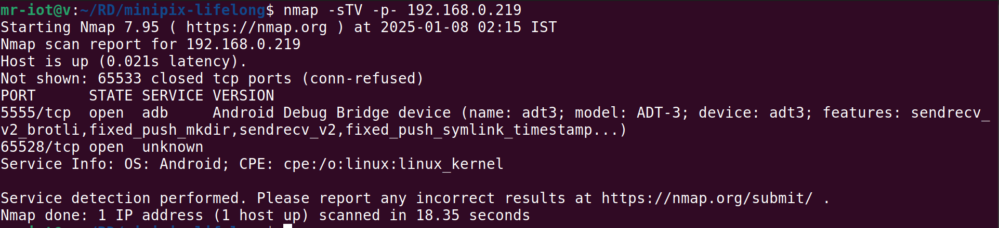
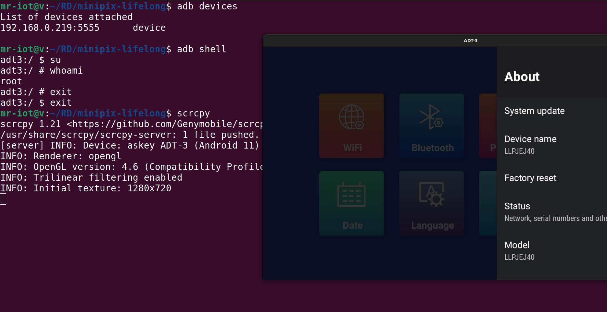

# 📸 When MiniLPix Became MiniPwn: ADB Over Wi-Fi Out of the Box?!

This wasn’t my most groundbreaking discovery — but definitely one of the funniest.

I had just ordered the **Lifelong MiniLPix portable projector** from Blinkit. A casual evening plan to binge-watch Game of Thrones quickly took a different turn.

Of course, the hacker in me couldn’t resist — every new device gets a quick scan on the network.

## 🔍 The Unexpected Surprise

After connecting the projector to my Wi-Fi, I ran an `nmap` scan — and to my surprise:

> **Port 5555 (ADB) was open!**

For context, port `5555` is used by **Android Debug Bridge (ADB)**. It’s a tool meant for developers to debug Android devices. But when exposed over Wi-Fi **without authentication**, it effectively means **remote root access**.

So yes, this compact video projector:
- Runs on **Android**
- Has **ADB over TCP** enabled **by default**
- Allows **unauthenticated access**

## 🧪 Proof of Concept

Here's what I captured during the test:

### 1. `nmap` scan showing port 5555 open  

---

### 2. ADB shell session — direct remote access  

## 💭 Final Thoughts

No vulnerabilities exploited. No fancy tools. Just a plug-and-play device offering a remote shell straight out of the box. 😅

It’s probably not a deliberate backdoor — just a critical misconfiguration. But it’s a solid reminder that **even something as simple as a video projector can expose serious attack surfaces**.

Stay curious. Stay cautious. And maybe… scan your smart gadgets before pressing play.

---

> 🐙 _“All I wanted was to watch Game of Thrones. Instead, I ended up debugging Android over Wi-Fi.”_
