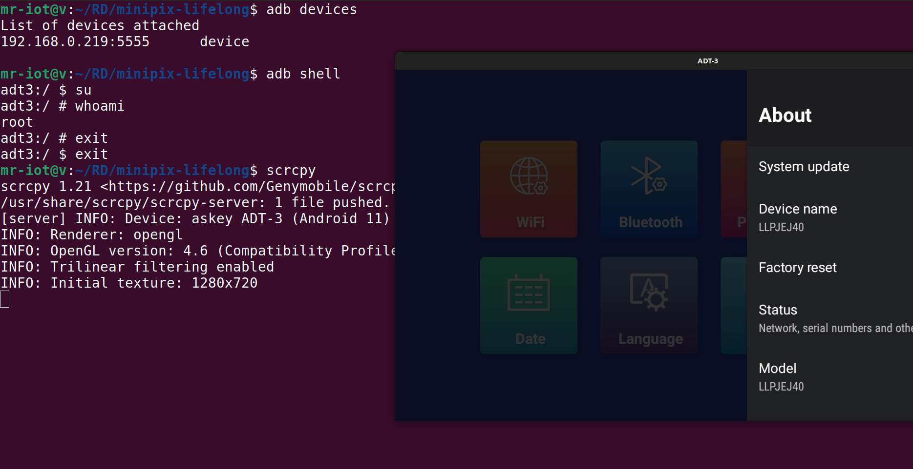

# 📸 When MiniLPix Turned into MiniPwn: ADB Over Wi-Fi Out of the Box?!

It wasn’t the craziest research, but definitely the funniest.

So, I ordered a **Lifelong MiniLPix portable thermal printer** from Blinkit. You know, just a regular day — planning to print some QR codes and stickers.

But the hacker in me can’t help it — every new device gets a quick scan on the network.

## 🔍 The Unexpected Discovery

After connecting it to my Wi-Fi, I fired up an `nmap` scan — and surprise, surprise:

> **Port 5555 (ADB) was open!**

For context, port `5555` is used by **Android Debug Bridge (ADB)**. It’s meant for developers to debug Android devices — but when exposed over Wi-Fi, it basically allows full remote access to the system.

So yes, this tiny thermal printer:
- Runs **Android**
- Exposes **ADB over TCP** by **default**
- Allows unauthenticated access

## 🧪 Proof of Concept

Here’s what I captured:

### 1. Initial `nmap` scan showing port 5555 open

---

### 2. ADB shell session — direct access into the device

## 💭 Final Thoughts

No fancy exploit. No fuzzing. Just plug, connect, and boom — remote shell on a photo printer. 😅

This probably isn’t an intentional backdoor, just a serious misconfiguration. But it’s a reminder that **even the most harmless-looking IoT gadgets can expose attack surfaces**.

Stay curious. Stay cautious. And maybe, just maybe, scan your printers.

---

> 🐙 _“All I wanted was to print a QR code. Instead, I ended up debugging Android over Wi-Fi.”_

